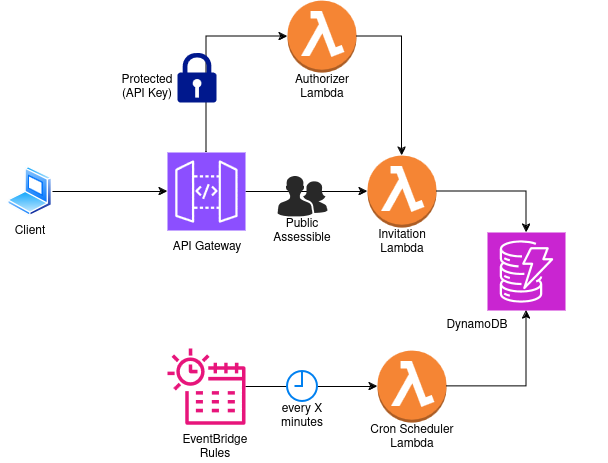

# Invitation Service
A simple serverless API Gateway App with AWS CDK for managing invitations.  
1. System admin can create invitations with verification code (valid for 7 days).
2. The invitee can confirm their invitation.
3. System admin can review all issued invitations.
4. System admin can invalidate an invitation (to be implemented).
5. Invitations beyond their expiry date are auto-expired.


## Architecture
<p align="left">
  
</p>

## Pre-requisite
1. Ensure CDK CLI is properly installed (refer [here](https://docs.aws.amazon.com/cdk/v2/guide/getting_started.html)). Verify by running the command:
```bash
cdk --version
```

2. Install python dependencies (at virtualenv of choice) and ensure virtualenv is active:
```bash
# from repo's root
cd app/
pip install -r requirements.txt
```

3. Ensure AWS CLI is setup (refer [here](https://docs.aws.amazon.com/cli/latest/userguide/cli-chap-getting-started.html)), and the user credentials have the following policies attached to create the CDK App successfully:
```bash
AmazonEC2ContainerRegistryFullAccess
AmazonS3FullAccess
AmazonSSMFullAccess
AWSCloudFormationFullAccess
IAMFullAccess
```

4. Verify the user credentials has all the policies needed by bootstrapping the project:
```bash
cdk bootstrap
```

5. Create an `.env` file from `.env.example`.
```bash
cp .env.example .env
```

6. Optional: check for CloudFormation synthesis error (Next step auto-checks)
```bash
cdk synth
```

7. Deploy the CDK App
```bash
cdk deploy
```

## API Documentation with Examples
<sample curls>


## Unit Tests
1. Install dependencies (at virtualenv of choice) and ensure virtualenv is active:
```bash
# from repo's root
cd app/
pip install -r requirements-dev.txt
```
2. Run tests
```bash
pytest -v
```

